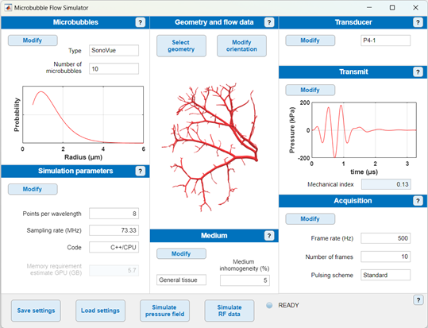

# Contrast-enhanced ultrasound simulator for microbubbles in vascular flow

## System requirements

- Installation of MATLAB is required. We recommend to use MATLAB 2019b or later as we cannot guarantee full functionality with older versions.
- The simulator was created and tested on Windows and Linux platforms. The simulator can also run on macOS, but the k-Wave binaries for accelerated simulation need to be compiled from the C++ source code. For Windows and Linux, the compiled binaries are readily available (see [Installation of the simulator](#installation-of-the-simulator)).
- Although the simulations can be run on a CPU, the use of a GPU is strongly recommended. GPU usage increases the speed of the k-Wave simulations by typically two orders of magnitude.
- The minimum requirements for the GPU depend on the specific parameters of the simulation, most notably the size of the computational domain. For practical use, we recommend a GPU with at least 8 GB of dedicated memory. For reference, we have tested the simulator on an Nvidia Quadro RTX 6000 24GB.

## Installation of the simulator

### Repository
**Method 1: Download ZIP file**
1. Click **code**
2. Click **Download ZIP**
3. Unzip the repository in the desired location

**Method 2: Clone with git**

`git clone https://github.com/NathanBlanken/microbubble-flow-simulator-gui.git`.

### k-Wave
1. Download k-Wave from [k-wave.org](http://www.k-wave.org/index.php) We strongly recommend the use of [k-Wave version 1.3](http://www.k-wave.org/downloadprevious.php). Place the root folder of k-Wave (`k-wave-toolbox-version-1.3`) in the root folder of this repository.
2. [Download](http://www.k-wave.org/download.php) the k-Wave C++ Simulation Codes for accelerated k-Wave simulations. These codes have already been compiled into binary files for 64-bit Linux and Windows systems. macOS users need to compile the C++ source code themselves. Place the binary files in the `binaries` folder (`k-wave-toolbox-version-1.3/k-Wave/binaries`).

**Note:** There is an issue with using k-Wave version 1.3 in MATLAB 2020A. A solution is provided [here](http://www.k-wave.org/forum/topic/error-reading-h5-files-when-using-binaries).

**Note:** If you use another k-Wave version or you install k-Wave in a different location (not recommended), you need to modify the installation paths in the file `PATHS.mat`, so that k-Wave can be located (see [Custom installation](#custom-installation) below).

### Example flow geometry data
Download example flow geometry data from [Zenodo](https://zenodo.org/records/10570013). Download the flow geometry folders you wish to use and place these in the folder `geometry_data`. As a minimum requirement, download the folder `renal_tree` as this is the default flow geometry.

### Flow solver module

**Note:** Users who only use the example flow data from [Zenodo](https://zenodo.org/records/10570013) do not have to install the APES suite and Musubi.

- Download the APES Suite from [GitHub](https://github.com/apes-suite).
- Download the LBM solver [Musubi](https://geb.inf.tu-dresden.de/doxy/musubi/index.html).
- See the APES and Musubi documentation for further details on the installation.

### vtkToolbox

**Note:** Users who only use the example flow data from [Zenodo](https://zenodo.org/records/10570013) do not have to install the vtkToolbox.

The output of Musubi is in VTU format. You need the vtkToolbox to convert VTU data to a MATLAB readable format. 
- Download he VTU toolbox from [MATLAB File Exchange](https://nl.mathworks.com/matlabcentral/fileexchange/94993-vtktoolbox) or [GitHub](https://github.com/KIT-IBT/vtkToolbox).
- Copy the contents of vtkToolbox to `geometry_data/vtkToolbox`.

### Custom installation
We strongly recommend to install the software components (such as k-Wave) in the specified locations. However, if you wish to install components in different locations, you need to modify the file `PATHS.mat`:
- In MATLAB, navigate to the root folder of the repository.
- Load the file: `load('PATHS.mat')`
- View the table: `open('PATHS')`
- Enter `'FULL-PATH-TO-MODULE'` in the relevant `Path` field. Do NOT modify the `Description` field.
- Leave the `Path` fields empty for components that are installed in the default location.
- Save the file: `save('PATHS.mat','PATHS')`.

## Simulation setup

Start MATLAB and navigate to the root folder of this directory. Start the graphical user interface (GUI) by running `MainGUI.mlapp` in the root folder. To do so, either:
- right-click on the file `MainGUI.mlapp` in the MATLAB panel "Current Folder" and click **Run** in the drop-down menu or
- enter `run MainGUI` in the MATLAB command window.

The main window opens:

**Note**: Do not open the application more than once (do not have more than one main window open at the same time) as this can lead to unexpected behavior with the MATLAB path.

### Simulation settings panels
- The main window consists of seven panels controlling different aspects of the simulation.
- Each panel summarizes the key parameters of the corresponding simulation aspect. These parameters _cannot_ be modified directly in the main window.
- To modify the parameters, click **Modify** in the relevant panel to open a pop-up window displaying the key parameters and some additional parameters. 

The seven panels are listed below. Click on the links for further information on each panel.

- [Microbubbles](documentation/MicrobubblesGUI.md) - Set the bubble properties and the size distribution
- [Geometry and flow data](documentation/GeometryGUI.md) - Select flow geometry and modify the orientation
- [Transducer](documentation/TransducerGUI.md) - Select or define the transducer
- [Simulation parameters](documentation/SimulationParametersGUI.md) - Set hardware and modeling parameters
- [Transmit](documentation/TransmitGUI.md) - Set the transmit pulse and beam properties
- [Medium](documentation/MediumGUI.md)  Set the physical properties of the tissue and the embedded vessel
- [Acquisition](documentation/AcquisitionGUI.md) - Set pulsing scheme and acquisition parameters

### Generic behavior of the pop-up windows
Each of the pop-up menus that can be accessed by clicking **Modify** have the following generic buttons:
- **Reset** resets all values of the pop-up window to the default settings. The window remains open.
- **Apply** applies the changes and closes the window.
- **Cancel** discards all changes that were made since the window opened and closes the window.
- The close button has the same bevior as **Cancel**.

Note that only one pop-up window can be open at the same time. You need to click **Apply** or **Cancel** before you can move on to another window. This prevents unexpected behavior as the settings in the different windows are not independent.

### Saving settings, loading settings, and running the simulation
At the bottom of the main window there are buttons to load and save simulation settings and to run a simulation:
- Click **Save settings** to save a MATLAB data file (.mat) containing all the current settings in the GUI. The default save folder is `simulation-settings`.
- Click **Load settings** to load previously saved simulation settings.
- Click **Simulate pressure field** to simulate the pressure field emitted by the transducer with the current simulation settings. The field is visualized by displaying the pressure amplitude map in two orthogonal planes (the lateral plane and the elevation plane).
- Click **Simulate RF data** to run the RF data simulations directly on the local machine with the current GUI settings. It will run on CPU or GPU depending on the parameters in the panel Simulation parameters. See [Running the simulation from the graphical user interface](#running-the-simulation-from-the-graphical-user-interface) for further details.

**Note:** If your computer does not have a GPU with at least 8 GB of dedicated memory, we advise to prepare your settings and ground truth data locally, and run the simulation [from the command line](#running-the-simulation-from-the-command-line) on a remote system.

**Note** If you are using the default settings and you click **Simulate RF data** or **Simulate pressure field** a computationally demanding simulation will start. If you only want to test the functionality of the code and are not interested in a physically realistic scenario, you can click **Load settings** and select the file `test_settings.mat`.

## Running the simulation from the graphical user interface

After completion of the simulation setup, you can run the simulation directly on the local machine by clicking **Simulate RF data** at the bottom of the main window. 
- If the streamlines have not been generated or a ground truth folder selected  in the pop-up window of the "Aquisition" panel (see below), the simulator will automatically generate and save the ground truth bubble locations in the folder `microbubble-flow-simulator-gui-main/ground_truth_frames/TIMESTAMP`.
- The RF data will be stored in `RESULTS/TIMESTAMP`.
- If nonexistent, the folder `RESULTS` and `ground_truth_frames` are automatically created.

You may also choose to reuse previously generated ground truth bubble location, e.g., to compare pulsing schemes:
- Click **Modify** in the panel "Acquisition".
- Select **Reuse or precompute bubble ground truth locations**.
- Option 1: Click **Reuse ground truth** button. You will be prompted for the ground truth folder to use.
- Option 2: Click **Precompute ground truth**. The ground truth bubble locations will be computed and saved. The folder name then automatically appears in the title textbox "Ground truth folder".

### Interrupting the simulation

Once the simulation has started running, it does not return control to the graphical user interface until the simulation is complete. If you wish to quit the execution:
- Press <kbd>Ctrl</kbd>+<kbd>C</kbd> (press <kbd>Command</kbd>+<kbd>.</kbd> on macOS).
- Click **Reset status** to reset the status of the simulator to READY (the button **Reset status** appears only after starting the simulation.

Similarly, if the execution is interrupted due to an unexpected error, the status can be reset by clicking **Reset status**.

## Running the simulation from the command line

The simulation can also be run using the command line in MATLAB or a MATLAB script using the function `main_RF.m`. This is necessary for execution on a remote system without graphical output, e.g., a GPU server. Running from the command line or from a script offers additional advantages, such as: 
- Continue an interrupted simulation.
- Run a part of a larger simulation for preliminary checks.
- Choose to reuse a previously computed medium to keep the same background speckle pattern.
- Run the simulation in batches, if, for example, you need to simulate a large number of bubbles over many frames as this can saturate the GPU memory or the RAM.

The [example script](example_scripts/example_batched.m) `example_batched.m` in `example_scripts` runs the simulation in several batches. The script assumes you have already generated a GUI parameters output file (settings file) and a ground truth bubble locations folder.

**Note:** the initial k-wave simulation will have to be rerun for each subset but this is a minor part of the runtime if the number of bubbles and/or frames is large.

To run an RF simulation on a remote system without graphical output:
- Copy the repository to the remote system.
- Run `MainGUI` on your local device to set the simulation settings. Save the settings by clicking `Save settings`.
- Precompute ground truth data (see [Running the simulation from the graphical user interface](#running-the-simulation-from-the-graphical-user-interface)).
- Copy the ground truth data and the saved settings file to the remote system.
- Run the simulation on the remote system.

### Advanced modification of the k-Wave medium
To modify the k-Wave medium, for example, add a cyst or a specific geometry:
- Create the k-Wave medium without running a full RF data simulation (see [example_medium.m](example_scripts/example_medium.m)).
- Modify the medium with your own custom tools.
- Save the medium in the `RESULTS` subfolder in which you want to store the RF data.
- Run the RF data simulation with the `reuseMedium` argument set to `true` ([example script](example_scripts/example_batched.m)).

## Delay-and-sum (DAS) image reconstruction

The folder `image-reconstruction` in the root directory of the simulator contains the script `run_reconstruction.m`. 
- Run the script.
- At the first prompt, select the folder containing the results of the simulation.
- At the second prompt, select the GUI parameter file (settings file) corresponding to the simulation.

This will run the DAS image reconstruction, display the results, save a movie and the reconstructed data. The movie and the data are saved in the working directory, with the name of the simulation.

## New geometries and flow simulations

Use the flow solver module (Musubi) to:
- Run flow simulations on a new flow geometry.
- Run flow simulations on an existing geometry with new boundary conditions.

Refer to the documentation of [Musubi](https://geb.inf.tu-dresden.de/doxy/musubi/index.html) for instructions on the flow simulations.

The simulator has been created and tested to be compatible with Musubi. Currently, the simulator is only compatible with steady flow simulations. We have not tested compatibility with other CFD simulators. Musubi will be integrated directly into the simulator in a future version.

The output of the flow simulations is in VTU format. Before the flow data can be used for the acoustic simulations, the data needs to be converted to MATLAB format, stored in the right folder, and supplemented with metadata. Detailed instructions on how to do this can be found in [Importing new flow geometries and flow data](documentation/NewGeometry.md).

If you believe your geometry is useful to other researchers, do not hesitate to share it with us so that we can add it to the database.

