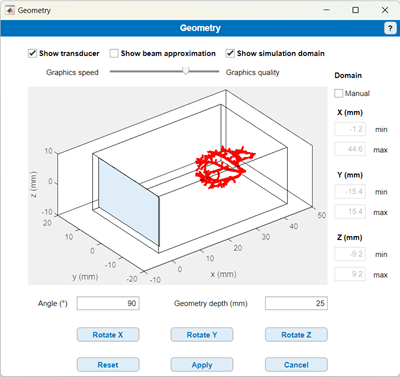

# Geometry and flow data

Return to [README](../README.md#simulation-settings-panels)

Return to [root](..)

The "Geometry and flow data" panel in the main window has two buttons:
- Click **Select geometry** to select the vascular geometry and the associated flow data.
- Click **Modify orientation** to modify the position and orientation of the vasculature and to modify the simulation domain.

## Selecting a flow geometry
- Click **Select geometry** in the "Geometry and flow data".
- Select the folder containing the vascular geometry (STL file) and the flow data (`vtu.mat`).

For importing new vasculature and flow data, see [New geometries and flow simulations](../README.md#new-geometries-and-flow-simulations).

## Modifying the position, orientation, and simulation domain
Click **Modify orientation** to open the "Geometry" window:

The figure axes show:
- The vessel structure (vertices of the STL mesh),
- The transducer surface (select **Show transducer**),
- An approximation of the ultrasound beam (select **Show beam approximation**),
- The simulation domain (select **Show simulation domain**).

The slider changes the number of STL vertices displayed in the figure.
- Move the slider towards **Graphics speed** to decrease the number of mesh vertices displayed.
- Move the slider towards **Graphics quality** to increase the number of mesh vertices displayed.
- For the ultrasound simulation, the full STL mesh is alwasy used. The position of the slider has no effect on this.

Enter a value in **Geometry depth** to change the position of the vasculature. The depth is defined as the distance between the vascular geometry and the transducer surface along the transmit axis.

To change the orientation of the geometry:
- Enter the rotation angle you wish to apply in the **Angle** field.
- Click on **X**, **Y** or **Z** to apply a rotation about that respective axis. (X, Y, Z as indicated in the figure axes).

By default, the simulation domain is automatically set to encompass the vascular geometry, and the transverse profile of the ultrasound beam. To modify the simulation domain manually:
- Click **Manual** (below the **Domain** label).
- Modify the domain limits by entering values in their respective fields.
