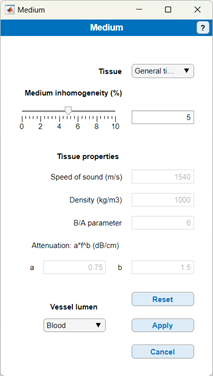

# Medium

Return to [README](../README.md#simulation-settings-panels)

Return to [root](..)

The simulator currently offers a list of representative tissue properties extracted from literature [1]. To select a tissue type:
- Select the **Tissue** dropdown menu.
- Click on the tissue you want to use.
- Click **Custom** in order to modify the speed of sound, density, nonlinearity parameter, and the attenuation coefficients.

_Medium inhomogeneity_ is defined as the sub-wavelength spatial inhomogeneity of density and speed of sound of the tissue. This inhomogeneity gives rise to background scatter and results in fully developed speckle in the ultrasound images. Therefore, the strength of the speckle is controlled by adjusting the medium inhomogeneity. The inhomogeneity is implemented as random spatial variations on the 3D speed of sound and density maps. The amplitude is expressed as a percentage of the mean value of these quantities. For full details of the implementation, see the function [define_medium.m](../acoustic-module/define_medium.m).

To modify **Medium inhomogeneity** either:
- Move the slider or
- Enter a value in edit box.

If you use the hybrid simulator, we advise keeping the value at 2% or below, as the hybrid simulator becomes decreasinly physically accurate for higher values [2]. Currently, physically realistic values of the medium inhomogeneity must be determined emperically (by comparing the simulated data to in-vivo data). In a future version, physically realistic values will be provided for each tissue type.

Select **Vessel lumen** to choose the liquid inside the vessel lumen, which can be either blood or water. 
- The acoustic properties of the vessel lumen liquid are applied at the location of the vessel (within the STL mesh).
- The medium inhomogeneity is not applied to the vessel, as it is hypoechoic.
- Thermodynamic properties of the vessel lumen liquid are used to compute the microbubble response.

## References

[1] Haim Azhari, “Appendix A: Typical acoustic properties of tissues”, in _Basics of Biomedical Ultrasound for Engineers_, pp. 313–314, John Wiley & Sons, Inc., 2010.

[2] Nathan Blanken, Baptiste Heiles, Alina Kuliesh, Michel Versuis, Kartik Jain, David Maresca, Guillaume Lajoinie, _PROTEUS: a physically realistic contrast-enhanced ultrasound simulator_

