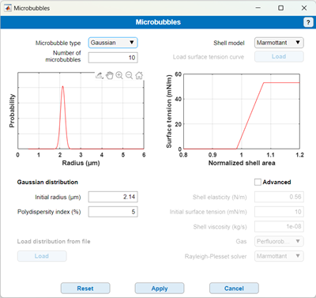

# Microbubbles

Return to [README](../README.md#simulation-settings-panels)

Return to [root](..)

The "Microbubbles" panel allows you to choose the type of microbubbles and number of contrast microbubbles.

**Left** 2 types of bubbles distributions have been pre-programmed into the simulator, which can be seen upon unfolding the drop-down menu. The **SonoVue** option makes use of the polydisperse distribution for the SonoVue agent [1]. The **Gaussian** option allows for defining a Gaussian size distribution with a specific polydispersity index (PDI). A PDI of 5% has a good a priori representation of monodisperse agents produced using microfluidics. The size and PDI can be set below the size distribution plot. The Third option, **Custom**, allows the user to load a Custom size distribution from a mat file containing a **Distribution** structure containing the fields:
- **Distribution.R**: vector of radii where the distribution is defined.
- **Distribution.P**: probability distribution (must have the same size a Distribution.R)
Note that bubbles with a size below 0.5 µm will be removed since they slow down dramatically the solver that computes the microbubble responses.

**Right** The user can also choose the phospholipid shell model to employ in the **Shell model** drop-down menu. There as well the simulator offers 3 possibilities for the surface tension versus radius curve. The first is the now common Marmottant model [2] The Second is the curve experimentally measured by Segers et al [3]. You may also choose to load your own curve describing the surface tension as a function of the bubble area (i.e., R^2). This information must be contained in a mat file containing the structure **fit** containing the following field:
- **fit.A_m**: vector of surface areas where the surface tension model is defined.
- **fit.sig**: Surface tension (must have the same size a fit.A_m)
Selecting the option **Advanced** by ticking the box below the surface tension plot allow for tuning he individual shell parameters. For now, the gas can either be SF6 or perfluorobutane. Both are used for contrast agents.

**Note 1 (memory usage)**: Choosing a large number of bubbles and a small voxel size will require large live memory as well. In that case, and if you require the large simulation, we advise to run the simulation in several subpart, using the StartFrame and EndFrame arguments of the **mainRF.m** function.

**Note 2 (memory usage)**: in the event of memory limitations, you may also change from off-grid sensors to on-grid sensors. The precision loss should be minimum if the voxels are sufficiently small.

## References

[1] Tim Segers, Pieter Kruizinga, Maarten P. Kok, Guillaume Lajoinie, Nico de Jong, and Michel Versluis. Monodisperse versus polydisperse ultrasound contrast agents: Non-linear response, sensitivity, and deep tissue imaging potential. Ultrasound Med. Biol., 44(7):1482–1492, July 2018. ISSN 0301-5629. doi: 10.1016/j.ultrasmedbio.2018.03.019. URL https://doi.org/10.1016/j.ultrasmedbio.2018.03.019.

[2] Philippe Marmottant, Sander van der Meer, Marcia Emmer, Michel Versluis, Nico de Jong, Sascha Hilgenfeldt, Detlef Lohse; A model for large amplitude oscillations of coated bubbles accounting for buckling and rupture. J. Acoust. Soc. Am. 1 December 2005; 118 (6): 3499–3505. https://doi.org/10.1121/1.2109427

[3] Tim Segers, Emmanuel Gaud, Michel Versluis, and Peter Frinking. High-precision acoustic measurements of the nonlinear dilatational elasticity of phospholipid coated monodisperse microbubbles. Soft Matter, 14(47):9550–9561, 2018. ISSN 1744-683X. doi: 10.1039/C8SM00918J. URL http://dx.doi.org/10.1039/C8SM00918J.
