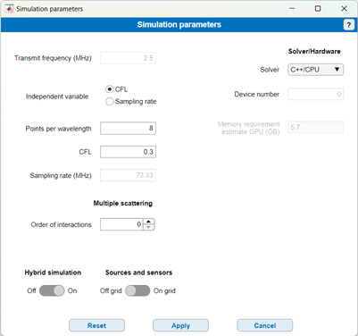

# Simulation Parameters

Return to [README](../README.md#simulation-settings-panels)

Return to [root](..)

The "Simulation parameters" panel is used to set the simulation parameters. The **Transmit frequency** is an indication based on the chosen transducer and cannot be modified.

The convergence criteria for the acoustic (k-wave) simulation can be reached either by using the Courant-Friedrichs-Lewy (CFL) number or the sampling rate. If you do not have specific requirements in that regard, we suggest leaving the default option CFL = 0.3. The sampling rate for the acoustic simulation is then directly calculated and displayed for reference.

The **Points per wavelength** field allows for changing the grid/voxel size in the k-wave simulation based on the ultrasound wavelength. This wavelength is estimated from the transmit frequency displayed in the top field. Note that k-wave requires at least 2 points per reconstructed wavelength. You may therefore have to adjust this field depending on the bandwidth of the selected transducer, or on the frequency content you are interested in. For example, the P4-1 reaches up to 5 MHz, which is twice the Transmit frequency displayed in the example above. You thus need at least 4 points per wavelength. If you do not use the hybrid simulator, note that this resolution will also limit the bubbles frequency that are handled by the simulator. Higher frequencies will be disregarded. This is not the case for the hybrid simulator (see below).

The field **Order of interactions** determines how many iterations are used to compute bubble-bubble interactions. 0 corresponds to neglecting bubble-bubble acoustic interactions, which is reasonable in as long as the mean bubble-bubble distance is large as compared to the bubble size since the acoustic emission from the bubble decays with 1/r, r being the distance to the bubble center. If many bubbles are used in a small geometry, bubble-bubble interactions may become important and setting an Order of interactions > 0 will provide more accurate results at the price of an increased computational cost. Empirically, more than 3 iterations for bubble-bubble interactions have a negligible impact on the results, even for bubbles that are very close to one another [1].

For a detailed explanation on the types of simulators, please refer to the published article. In short, the **full simulator** uses small k-wave grids to compute bubble-bubble interactions and the travel of the scattered waves back to the transducer. The full simulator therefore handles inhomogeneous propagation for bubbles scatter but is limited in frequencies by the simulation voxel size (see above, “Points per wavelength”). The **hybrid simulator** uses an analytical solution for dissipative wave propagation and can support the higher harmonics of the bubbles. It does not, however, account for tissue inhomogeneities in the signals backscattered by the bubbles. The hybrid simulation is significantly faster than the full simulation.

You can choose the **Sources and Sensor** to be on-grid or off-grid. This refers to the embedding of the microbubbles within the k-wave simulation grid. If you select on-grid, the bubbles will be placed in the nearest voxel, both for receiving the wave transmitted by the transducer and to emit the nonlinear scatter computed by the ODE solver. If you choose off-grid source and sensors, the simulator will use a sine distribution which, in k-space, allow for having microbubbles as receiver and as sources that are not snapped to the simulation grid. **Off-grid** is the recommended option (please see notes 1 and 2 in a. Microbubbles panel)

Finally, you can choose to run the simulation on **CPU** or on **GPU** **(requires CUDA compatibility)**. For the latter, you can also precise the number of the GPU you wish to use in a multi-GPU system. Note that the first GPU correspond to the address “0”. GPU simulations provide roughly a 100 times acceleration. We do not recommend running the simulator on CPU.

**Independent variable** is used to set the timesteps in the k-wave simulations: the user can either directly set the requested time step or use the Courant–Friedrichs–Lewy condition (recommended).

## References

[1] Yusefi H, Helfield B. The influence of inter-bubble spacing on the resonance response of ultrasound contrast agent microbubbles. Ultrason Sonochem. 2022 Nov;90:106191. doi: 10.1016/j.ultsonch.2022.106191. Epub 2022 Oct 6. PMID: 36223708; PMCID: PMC9563339.

