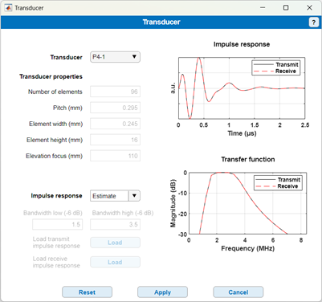

# Transducer

Return to [README](../README.md#simulation-settings-panels)

Return to [root](..)

The "Transducer" panel can be used to define the properties of the transducer. So far, the simulator proposes by the default the **Philips P4-1** phase array transducer, and the **Kolo L22-14v** linear array which have been calibrated using a needle hydrophone. Other transducers will be available in upcoming updates.

You may also choose to define a **Custom** transducer in the drop down panel. You will then have to fill in the specific properties of the transducer you want to simulate. Note that in that case, the phase response and impulse response will not be accurate but only estimates based on the bandwidth provided for the transducer.

Finally, if you have calibrated a transducer yourself that you wish to add, you can load your custom transmit and receive impulse responses using the buttons **Load transmit impulse response** and **Load receive impulse response**. (You first need to select **Load File** located in the drop-down menu under “impulse response” to activate the **Load** buttons.) The impulse response that you load (for both transmit and receive) must be stored in a mat file containing the structure **IR**. Th structure must contain the field **IR.IR** that contains the impulse response sampled at a fixed sampling rate of 250 MHz. 
