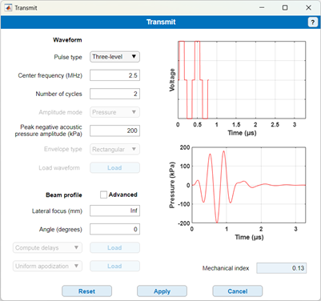

# Transmit

Return to [README](../README.md#simulation-settings-panels)

Return to [root](..)

The transmit panel allows you to define the specific transmit pulse you want to generate, based on you choice of transducer (see " c. Transducer panel"). The first choice offered to you in a drop-down menu is the type of generator you want to use to drive the transducer. The default choice is **three-level**, reflecting the usual tri-state generators available in programmable machines. You may  aslo decide to choose a true arbitrary ganaform generator with the option **Cosine envelope**. You will then also have to define the type of envelope you want to use (currently, rectangular or Hann). If you need a more specific choice, you can also load custom driving waveforms. Choosing the option **Custom (voltage)** enables the **Load** button and prompts for selecting the chosen voltage-based waveform. This option thus still uses the embedded voltage calibration of the transducer. You must load a mat file that contains a structure **CustomSignal**. This structure must contain the field **CustomSignal.V** representing the voltage-based waveform. The sampling rate is fixed by the k-wave simulation and must match the sampling rate provided in the “Simulation parameters” panel (in the example below 73.33 MHz).

Similarly, the option **Custom (pressure)** requires loading a mat file with the same structure CustomSignal, but this time containing a field **CustomSignal.p**. For the rest, the pulse definition is based on the center frequency, pulse length in number of cycles and acoustic pressure.

The bottom part of the pop-up window allows for choosing the beam shape of the transmission, using the tradional focus depth (**Lateral focus (mm)**) and steering angle (**angle (degrees)**). The **Advanced** tick box enables loading custom delays, i.e., the delay applied to each element in transmit, and custom apodization. For the delays, you must load a mat file containing the structure **Delays** containing a field **Delays.delays** in seconds, that has the same length as the number of elements in the transducer. Likewise, the apodization must be stored in a mat file with the structure **Apodization** containing a field **Apodization.apodization** that has as length the number of elements in the transducer.

The mechanial index cannot be edited and is computed since it is an important safety for most applications.
